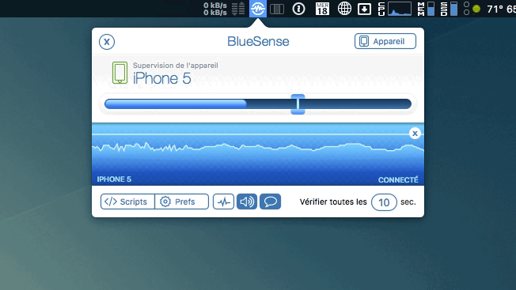

# BlueSense AppleScripts

Exemples of AppleScripts that can be used with [BlueSense](https://apps.inspira.io/en/bluesense/) for Mac or elsewhere to control Mac OS X.

* deezer-osx-play-music.applescript - Play/Pause Deezer for Mac
* disable-screen-saver-password.applescript - Disable the screensaver password
* enable-osx-session-auto-login.applescript - Enable the automatic session to login with your username.
* skype-change-status-online.applescript - Change the status of Skype (Online/Away).
* spotify-osx-play-music.applescript - Play/Pause Spotify for Mac.
